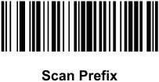
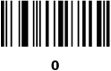
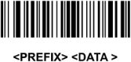

# LTESS Tracer Scanner Setup

## Setup Procedure

In the following procedure you will learn how to setup a **Zebra Symbol** scanner to work with the RS232 interface in a **LTESS** machine.

This will utilize the Fujitsu RS232 protocol, as well as a prefix letter/number, due to the machine omission of the first character in the payload.

### Things you will need
- Zebra Symbol Barcode Reader (preferably DS2208 or any other with the same functions).
- RS232 interface cable compatible with Zebra Symbol readers.
- External power supply (the one that comes with the interface cable or any other that matches the specs).

### Physical Setup
1. Connect the power supply to mains voltage.
1. Connect the other end of the power suply cable to the barrel plug in the interface cable.
1. Connect the RJ45 terminal of the interface cable to the barcode reader.
1. From this point you can start programming the barcode reader, plug the DB9 end of the interface cable to the barcode reader terminal of your LTESS machine after you are done programming the reader.

### Programming

#### Step 1

Scan the **Restore Defaults** barcode \

#### Step 2

Scan the **Fujitsu RS-232** barcode \

#### Step 3

Scan the **Prefix Data Transmission Format** barcode

#### Step 4

Setup the letter/number to use as prefix \

To do this setup we will use the **1049** ASCII code that represents a number "1" keystroke.

#### Step 5

Scan the **Options** barcode \

#### Step 6

Scan the **\<Prefix\>\<Data\>** barcode \
